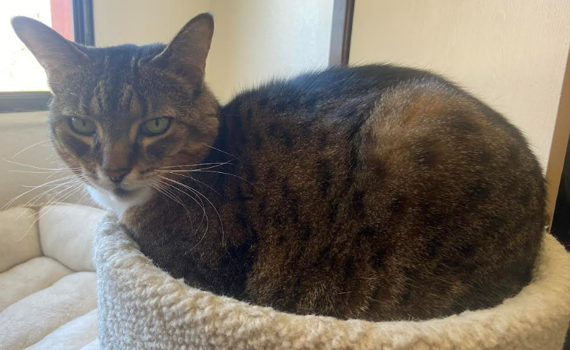

Along with my partner, I have a sweet old kitty named Ellie. I have been spending insane amounts of time with her and am always up for some cat chatter.

Reading non-mathematical books is hard, so writing what Im **Trying** to read here to have more accountability for myself. 

1. In the Presence of Mine Enemies by Edward L. Ayers
2. Brief

I typically focus intently on a hobby for some time period before I move on to the next. Here are some of my obsessions in chronological order:

1. Gardening
2. Rock climbing
3. Pottery  
4. Hiking  
5. Bird photography

